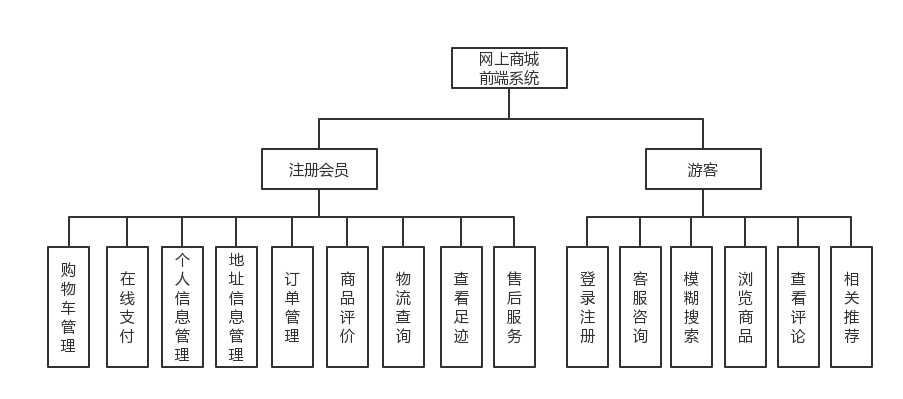
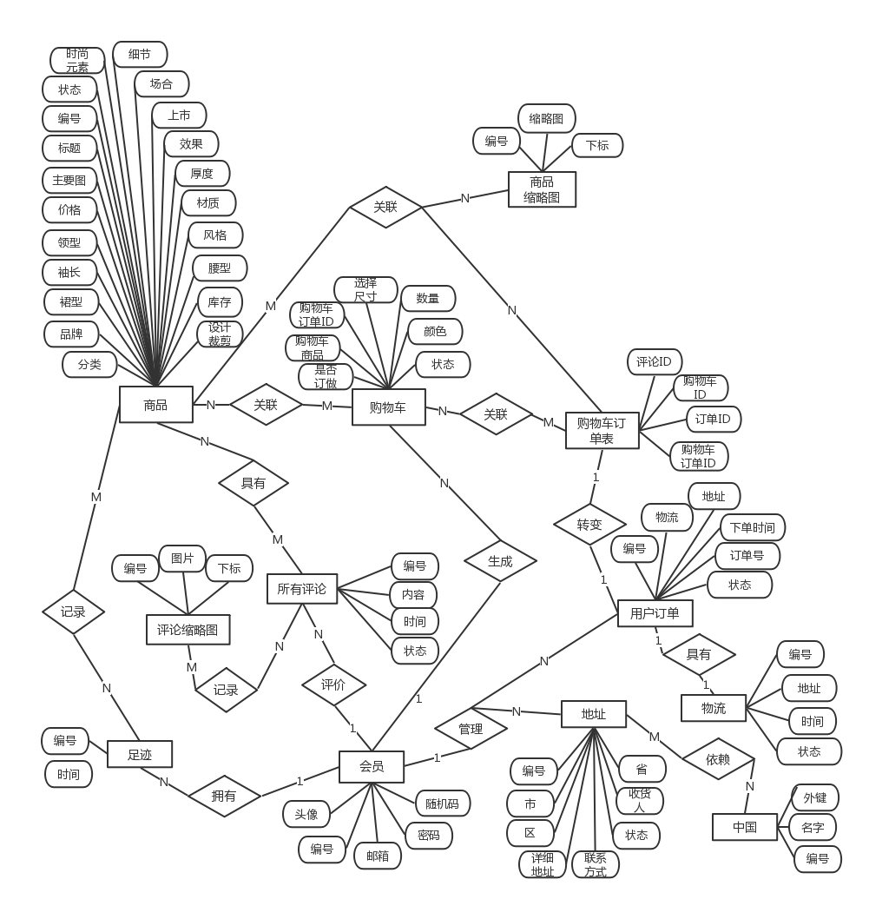
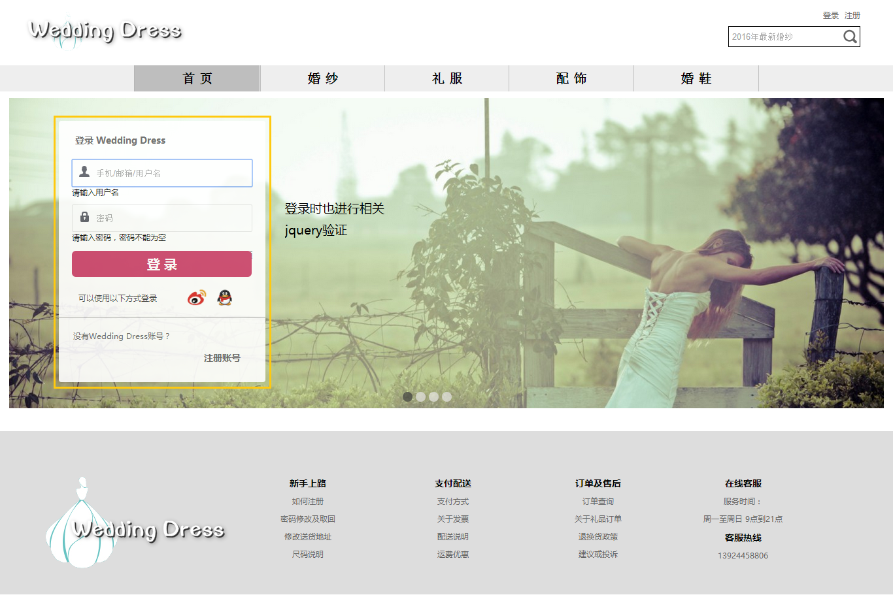
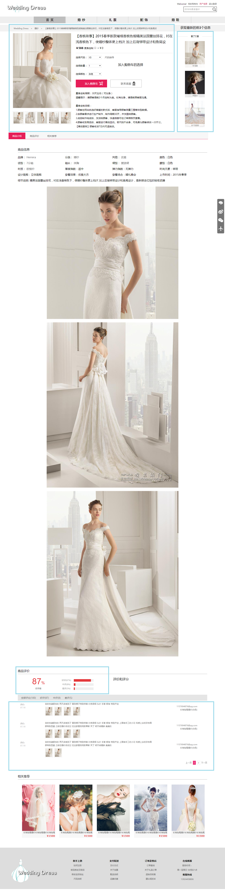

### B2C网上商城：web前端系统的设计与实现
【完成于2016/08/26，后端用的是SSH（Struts2+Spring+hibernate）框架前端方面用的是最基本的html+css+js，通过需求去实现功能模块的过程去不断深入了解前端基础，例如一些小插件的实现。由于此项目没有做到前后端的分离，各种功能紧耦合，这个毕业设计项目不会更新】

- 软件开发环境： mysql + windows 10 + jdk1.8 + eclipse
- 开发工具： Eclipse + mysql + HBuilder
- 使用技术： SSH  +  jsp  +  JavaScript  +  jQuery
- 项目描述： 在这个网上商城项目中，实现了用户登录注册找回密码，商品展示，商品分类，展现商品详情信息，商品评价，相关商品的推荐，我的足迹，加入购物车功能，模拟结账流程，账号管理，地址管理，订单管理，多图片上传和后台管理（订单管理，商品管理，统计数据）的功能
- 责任描述：独立完成需求分析，前端界面设计与实现，数据库设计和后端Java逻辑代码的编写

##### 框架图
根据系统访问角色的设计要求，包括注册会员和游客，其中本系统的功能模块主要分为十五个功能模块，

##### 实体关系图（E-R图）
针对网上商城系统，通过对系统工作流程、内容以及模块设计分析，本次数据库主要E-R模型主要包括十一个实体，包括配送地址、地址（省市区）、商品详情、商品缩略图、评论、评论缩略图、足迹、物流展示、购物车订单、购物车、用户表、用户订单。具体属性联系如图所示

##### 部分界面展示
全部界面展示可以查看目录picture

